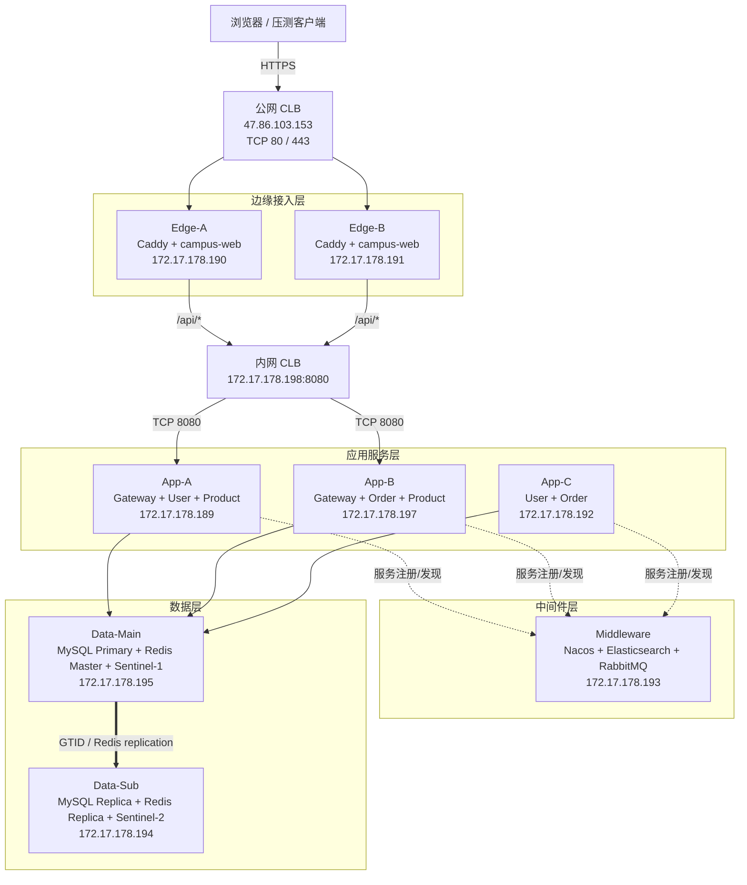

# 校园集市 8 节点 ECS 集群架构与部署说明

> 本文描述答辩环境中已经完成并验证的 8 节点部署拓扑、节点职责、网络路径、
> 高可用边界和恢复策略。具体命令以
> [`ops/multi-node/README.md`](../ops/multi-node/README.md) 为准。

## 1. 建设目标与适用范围

本方案在不修改 Java/Vue 业务逻辑的前提下，通过 Docker Compose、Nacos 服务发现、
公网/内网 CLB 和 ECS 安全组，将单机环境拆分为 8 台 ECS：

- 公网入口和静态资源双节点；
- Gateway、User、Product、Order 多实例；
- 中间件与业务进程隔离；
- MySQL、Redis 主从复制；
- 支持 Edge、Gateway、Product 单实例故障转移；
- 提供可复现的部署模板、健康检查和数据库切换脚本。

该集群用于课程答辩和临时压测，不等同于长期生产环境。Nacos、Elasticsearch、
RabbitMQ 仍为单节点，ECS 使用抢占式实例时也可能被云平台回收。

## 2. 总体架构



## 3. 节点与角色安排

VPC 网段为 `172.17.176.0/20`。

| 节点 | 公网 IP | 私网 IP | 容器/职责 |
|---|---|---|---|
| Edge-A | `8.218.58.199` | `172.17.178.190` | Caddy、campus-web |
| Edge-B | `47.243.210.172` | `172.17.178.191` | Caddy、campus-web |
| App-A | `47.76.254.89` | `172.17.178.189` | Gateway、User、Product |
| App-B | `8.218.45.65` | `172.17.178.197` | Gateway、Order、Product |
| App-C | `8.210.53.78` | `172.17.178.192` | User、Order |
| Middleware | `47.76.201.91` | `172.17.178.193` | Nacos、Elasticsearch、RabbitMQ |
| Data-Sub | `8.218.2.200` | `172.17.178.194` | MySQL Replica、Redis Replica、Sentinel-2 |
| Data-Main | `47.242.51.82` | `172.17.178.195` | MySQL Primary、Redis Master、Sentinel-1 |

公网 CLB 地址为 `47.86.103.153`，内网 CLB VIP 为
`172.17.178.198`。ECS 公网 IP 仅用于运维，不作为业务域名直接入口。

## 4. 请求链路

### 4.1 静态资源

```text
浏览器
  → summer.huangzixuan.asia
  → 公网 CLB:443
  → Edge-A/B Caddy
  → campus-web:8080
  → Vue SPA
```

公网 CLB 使用两个虚拟服务器组：

- `edge-http`：Edge-A/B `:80`；
- `edge-https`：Edge-A/B `:443`。

Caddy 在每个 Edge 节点独立保存 Let's Encrypt 证书。首次签发及续期需要将公网
CLB 的 `80/443` 两个服务器组同时按节点逐台切流，确保 HTTP-01 与
TLS-ALPN-01 都命中正在签发/续期的 Edge。

### 4.2 API 请求

```text
/api/*
  → 公网 CLB
  → Edge Caddy
  → campus-web Nginx
  → GATEWAY_UPSTREAM=http://172.17.178.198:8080
  → 内网 CLB
  → App-A/B Gateway
  → Nacos 发现 User/Product/Order 实例
```

Edge 内部使用固定 Docker 网络 `192.168.250.0/24`，Nginx 的
`TRUSTED_PROXY_CIDR` 也固定为该网段。campus-web 不映射宿主机 8080，
不能绕过 Caddy 直接访问。

## 5. 服务副本与故障边界

| 服务 | 实例 | 分布 | 故障处理 |
|---|---:|---|---|
| Caddy + Web | 2 | Edge-A/B | Caddy 端口故障由公网 CLB TCP 摘除 |
| Gateway | 2 | App-A/B | 内网 CLB TCP 摘除 |
| User | 2 | App-A/C | Nacos 摘除异常实例 |
| Product | 2 | App-A/B | DB/缓存类接口可转移；本地图片不具备跨机 HA |
| Order | 2 | App-B/C | Nacos 摘除异常实例 |
| Nacos | 1 | Middleware | 单点；故障时服务发现受影响 |
| Elasticsearch | 1 | Middleware | 单点；搜索受影响 |
| RabbitMQ | 1 | Middleware | 单点；异步消息受影响 |
| MySQL | 1 主 1 从 | Data-Main/Sub | GTID 复制，人工提升 |
| Redis | 1 主 1 从 | Data-Main/Sub | 有复制副本，但应用侧不具备自动切换 |
| Sentinel | 2 | Data-Main/Sub | 监控/演示，整机故障时不满足多数派 |

Spring Boot 服务当前未引入 Actuator，CLB 健康检查必须使用 TCP：

- 公网 CLB：TCP `80/443`；
- 内网 CLB：TCP `8080`。

TCP 检查只能确认监听端口存在：例如 campus-web 停止但 Caddy 仍监听时，CLB
不会自动识别 Caddy 返回的 502。当前配置可检测 Caddy/Gateway 进程故障，
不等同于完整的 HTTP 业务健康检查。

## 6. 中间件与数据设计

### 6.1 Nacos、ES、RabbitMQ

- Nacos 采用 standalone，用于 Gateway、User、Product、Order 注册发现；
- Elasticsearch 单节点，商品搜索索引不配置副本；
- RabbitMQ 单节点，承载订单通知等异步消息；
- Middleware 发生整机故障时属于已知单点边界。

### 6.2 MySQL

- Data-Main：`server-id=1`、GTID、ROW binlog；
- Data-Sub：`server-id=2`、GTID、relay log、持久只读；
- 应用统一连接 Data-Main，不启用应用侧读写分离；
- 复制初始化使用 `prepare-primary-repl.sh` 和 `setup-replication.sh`；
- 计划切换先用 `fence-mysql-primary.sh` 持久围栏旧主；
- `promote-mysql.sh` 在提升前对齐旧主 GTID，并排空已接收 relay 事务；
- 故障切换必须先隔离旧主，且接受“未到达从库的事务可能丢失”的 RPO。

### 6.3 Redis

- Data-Main 提供 Redis Master；
- Data-Sub 提供 Redis Replica；
- Replica 和 Sentinel 均通告 ECS 私网 `HOST_IP`，避免暴露 Docker bridge IP；
- 应用当前仍直连 `REDIS_HOST=172.17.178.195`；
- 两个 Sentinel 的 quorum 为 2：仅 Redis Master 进程故障且两个 Sentinel
  都在线时可能完成选举；Data-Main 整机故障时只剩一个 Sentinel，不能达到 quorum；
- 即使 Sentinel 提升了副本，应用也不会自动发现新主，仍需人工修改
  `REDIS_HOST` 并滚动重启；
- 当前仓库没有承诺可用于生产的 Redis 人工提升脚本，答辩不将 Redis 自动切换
  作为已交付能力。

## 7. 安全组与端口

| 方向 | 端口 | 说明 |
|---|---|---|
| 公网 → 公网 CLB | `80,443` | 唯一业务入口 |
| 公网 CLB → Edge-A/B | `80,443` | 使用 CLB 后端服务器组回源 |
| 内网 CLB → App-A/B | `8080` | Gateway |
| VPC → App | `8081,8082,8083` | 服务调用与排障 |
| App → Middleware | `8848,9848,9200,5672` | Nacos、ES、RabbitMQ |
| App → Data-Main | `3306,6379` | MySQL、Redis |
| Data-Main ↔ Data-Sub | `3306,6379,26379` | 数据复制、Sentinel |
| 公网禁止 | `8080-8083,3306,6379,8848,9848,9200,5672,15672,26379` | 不直接暴露 |

各应用注册 Nacos 时必须设置本机私网 `HOST_IP`，防止服务注册成 Docker bridge 地址。
各 ECS 公网 IP 的 SSH 入口应仅向固定运维源 IP 放行。

## 8. 部署顺序

```text
1. 创建 VPC、vSwitch、安全组、公网 CLB、内网 CLB、DNS
2. Data-Main：启动主库/主 Redis，准备复制账号
3. Data-Sub：启动从库/从 Redis，建立并验证复制
4. Middleware：启动 Nacos、Elasticsearch、RabbitMQ
5. App-A、App-B、App-C：启动并验证 Nacos 实例
6. 配置内网 CLB 后端 App-A/B:8080
7. Edge-A/B：启动 Web/Caddy，逐台签发证书
8. 配置公网 CLB 双 Edge 后端
9. 执行公网端到端和故障转移验收
```

构建节点要求：

- JDK 17；
- Maven 3.9+；
- Node.js 18+；
- npm；
- Docker 与 Compose。

Middleware/Data 节点仅需要 Docker 与 Compose。所有 ECS 必须使用同一 Git commit，
Secret 只写各机 `ops/multi-node/.env`，不得提交 Git。

## 9. 2026-07-16 真机验收记录

以下结果来自部署当日的一次性验收记录，不代表持续监控状态。实例重建、配置更新或
抢占式回收后，需要重新执行 `health-check.sh` 和端到端测试。

| 测试 | 结果 |
|---|---|
| 公网首页与商品列表 | HTTPS 200，正式 Let's Encrypt 证书 |
| 注册、登录、JWT 用户信息 | 全链路成功 |
| Edge-A Caddy 停止 | 公网请求全部切到 Edge-B；未覆盖“仅 Web 停止” |
| App-A Gateway 停止 | 内网 CLB 切到 App-B Gateway |
| App-A Product 停止 | 商品列表请求由 App-B Product 承接；未覆盖本地图片 |
| MySQL 主从 | IO/SQL=Yes，延迟 0，无复制错误 |
| Redis 主从 | `master_link_status=up` |
| Middleware 重建 | 应用自动重新注册，四类服务各 2 实例 |

## 10. 备份与恢复

云盘快照只保存磁盘块，不保存内存、容器运行状态、CLB、安全组、DNS 或网络拓扑。
可重建、可恢复所需的核心备份包括：

1. Data-Main/Data-Sub 数据盘快照；
2. MySQL 逻辑备份；
3. App-A/B `PRODUCT_IMAGE_HOST_DIR` 的文件备份，或迁移 OSS/NFS；
4. 各节点 `.env` 的离线安全备份；
5. GitHub `main` 中的 Compose 和运维脚本；
6. CLB、VPC、安全组和 DNS 配置记录。

自定义镜像是加快 ECS 重建的可选手段，不是 Compose 重建的必要条件。需要镜像时，
同类 Edge 可共用；App-A/B/C、Middleware、Data-Main、Data-Sub 按角色分别制作。
一个 ECS 镜像不能直接恢复整个 8 节点集群，也不会包含 CLB/VPC 配置。

## 11. 已知限制与生产化方向

当前答辩方案明确接受以下限制：

- 抢占式 ECS 可能被回收；
- Nacos、Elasticsearch、RabbitMQ 是单点；
- Redis Sentinel 未被应用客户端接入；
- MySQL 未实现应用侧自动读写分离；
- Product 双实例图片目录不共享；当前 Gateway 没有将图片上传和读取固定到同一实例，
  图片请求可能命中另一台并返回 404。答辩若演示上传，应临时只保留一个 Product
  实例处理图片路径；长期方案必须接入 OSS/NFS；
- 双 Edge Caddy 证书存储不共享，需逐台签发和续期；
- 未采用 Kubernetes。

长期生产化建议：

- 使用包年包月/按量实例替代核心层抢占式实例；
- Nacos、RabbitMQ、Elasticsearch 建立奇数节点集群；
- 图片迁移 OSS；
- 引入托管数据库/缓存或数据库代理；
- 用 Terraform/ROS 固化 VPC、CLB、安全组和 ECS；
- 接入 Prometheus、Grafana 和集中日志。

## 12. 相关文件

| 文件 | 用途 |
|---|---|
| `ops/multi-node/README.md` | 逐机部署与故障演练手册 |
| `ops/multi-node/.env.cluster.example` | 集群环境变量模板 |
| `ops/multi-node/docker-compose.*.yml` | 各角色 Compose |
| `ops/multi-node/scripts/up-role.sh` | 按角色启动 |
| `ops/multi-node/scripts/health-check.sh` | 按角色健康检查 |
| `ops/multi-node/scripts/setup-replication.sh` | MySQL 复制初始化/恢复 |
| `ops/multi-node/scripts/promote-mysql.sh` | MySQL 人工提升 |

