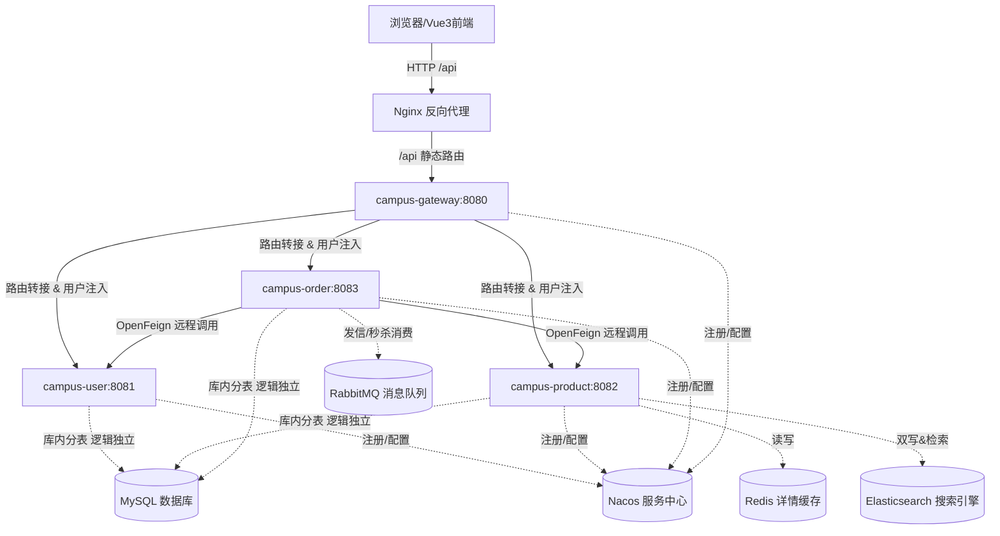

# 校园二手交易平台 —— 架构设计（全局概览）

本项目为微服务分布式架构体系。为了保障 AI 助手在辅助编码时不被冗余信息淹没，具体模块的表结构定义、缓存和 MQ 实现机制已**全部拆分下沉到子模块的 `DOC.md` 中**。

请在开发对应模块时直接阅读其子目录文档。

---

## 📂 技术设计文档目录索引

1. **核心 Result & 异常捕获基石**：包含统一响应、拦截异常以及 JWT 解析。
   * 👉 详见：[campus-common/DOC.md](file:///Users/katisarrow/summer/campus-trade/campus-common/DOC.md)
2. **流量网关与全局鉴权规则**：包含 WebFlux 网关配置与 `X-User-Id` 的注入。
   * 👉 详见：[campus-gateway/DOC.md](file:///Users/katisarrow/summer/campus-trade/campus-gateway/DOC.md)
3. **用户微服务设计**：包含用户表实体结构及注册登录的底层实现。
   * 👉 详见：[campus-user/DOC.md](file:///Users/katisarrow/summer/campus-trade/campus-user/DOC.md)
4. **商品与高并发缓存/检索设计**：包含商品表设计、Redis详情缓存 (防击穿防雪崩防穿透) 与 ES 双写及检索方案。
   * 👉 详见：[campus-product/DOC.md](file:///Users/katisarrow/summer/campus-trade/campus-product/DOC.md)
5. **订单、秒杀削峰及通知设计**：包含订单与通知表结构、RabbitMQ 拓扑关系、Feign RPC 客户端、以及 Redis+MQ 秒杀事务落库机制。
   * 👉 详见：[campus-order/DOC.md](file:///Users/katisarrow/summer/campus-trade/campus-order/DOC.md)
6. **前端 SPA 与静态托管设计**：包含前端工程结构、网络拦截器以及生产环境 Nginx 双反代容器编排。
   * 👉 详见：[campus-trade-web/DOC.md](file:///Users/katisarrow/summer/campus-trade-web/DOC.md)

---

## 1. 整体架构拓扑

---

## 2. 数据库设计原则
各微服务数据库采用 **“物理同库、逻辑独立”** 架构：
- 严格禁止微服务直接 Join 跨服务表，微服务只能通过 OpenFeign 调取其他模块的 RPC 接口获取数据。
- 允许在必要的高频关联表中建立数据冗余（例如 `t_order` 表冗余 `product_title` 字段），以空间换取减少服务间 RPC 的交互频率。
- 各模块的具体表物理字段及索引结构，请直接查阅子模块各自的 `DOC.md`。

---

## 3. 一键部署架构
- 本项目包含完整编排文件：
  - 中间件编排：使用 [docker-compose-mw.yml](file:///Users/katisarrow/summer/docker-compose-mw.yml) 拉起第三方中间件基础容器。
  - 全栈云端部署：使用根目录下的 [docker-compose.yml](file:///Users/katisarrow/summer/docker-compose.yml) 联动打包构建，一键启动包含全部 5 大业务容器在内的全分布式项目环境。
